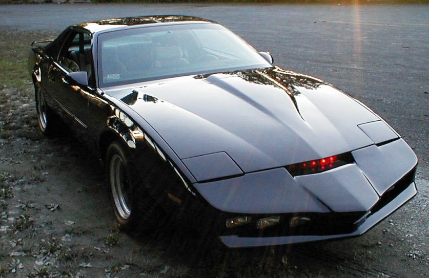
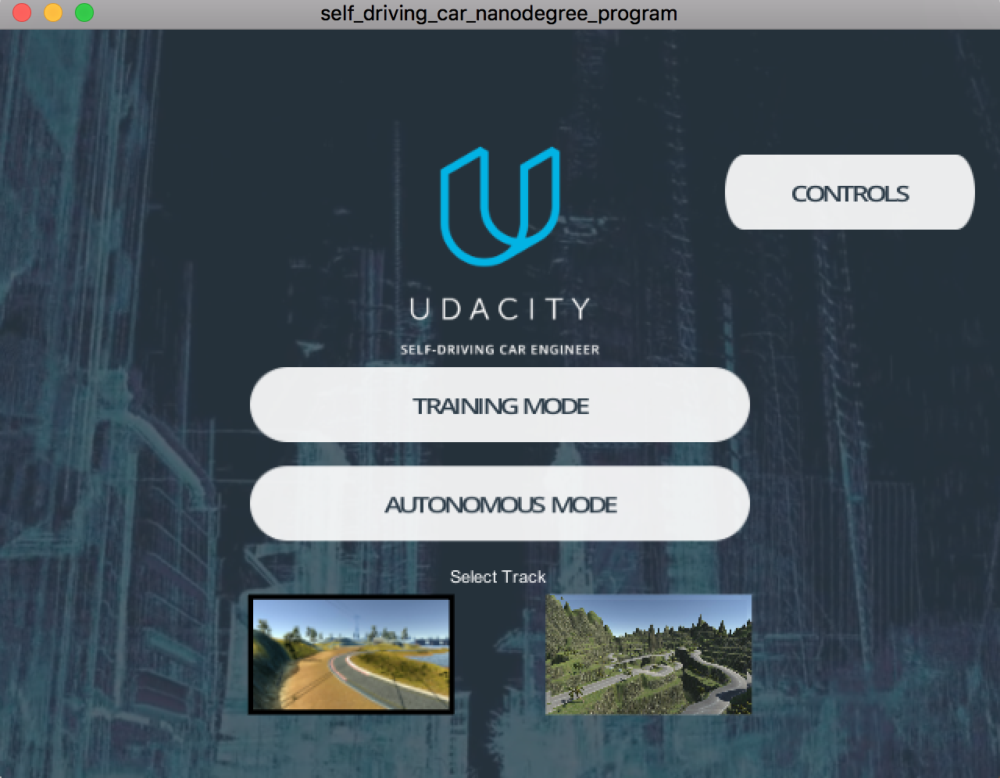
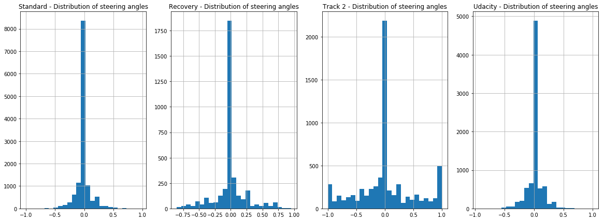
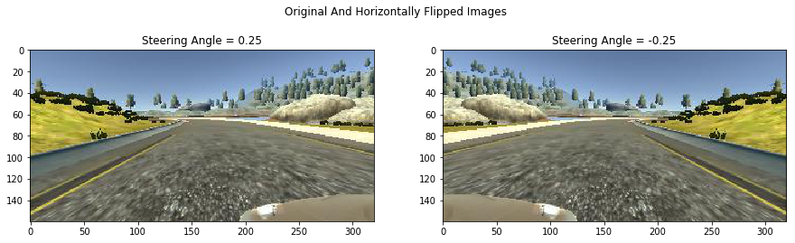
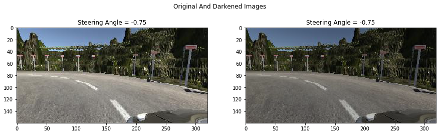
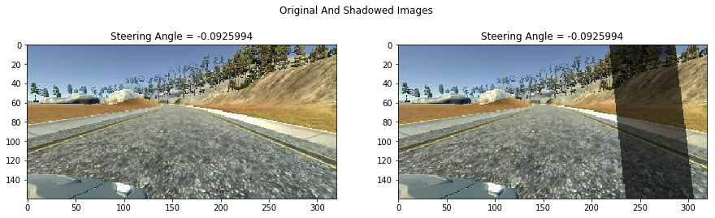
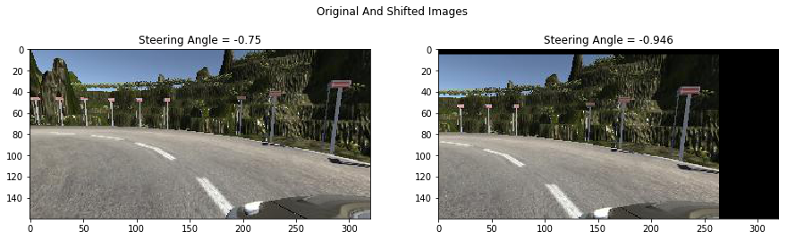
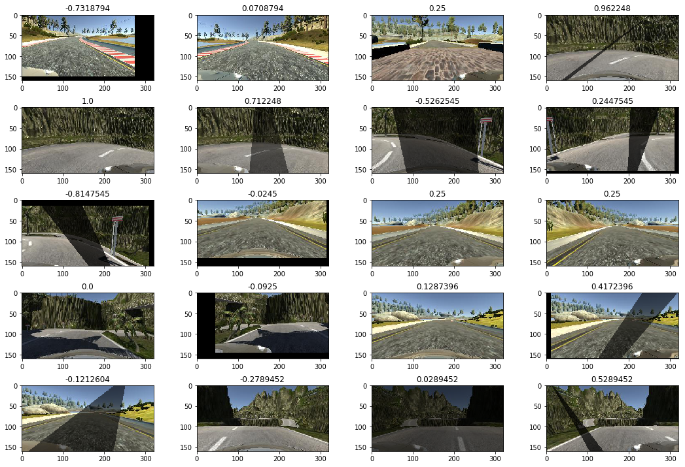
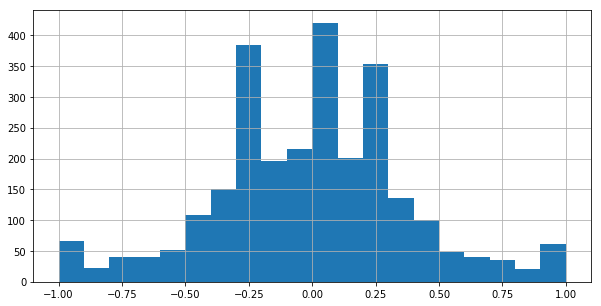

# Teaching Cars To Drive Autonomously




Over the recent years, and more particularly since the success of the [Darpa Grand Challenge](https://en.wikipedia.org/wiki/DARPA_Grand_Challenge) competitions a decade ago, the race towards the development of fully autonomous vehicle has accelerated tremendously. Many components make up an autonomous vehicle, and some of its most critical ones are the sensors and AI software that powers it. Moreover, with the increase in computational capabilities, we are now able to train complex and deep neural networks that are able to _learn_ crucial details, visual and beyond, and become the _brain_ of the car, instructing the vehicle on the next decisions to make.

In this writeup, we are going to cover how we can get train a deep learning model to predict steering wheel angles and help a virtual vehicle drive itself in a simulator. The model is created using Keras, relying on Tensorflow as the backend. This is project 3 of Term 1 of the [Udacity Self-Driving Car Engineer Nanodegree](https://www.udacity.com/course/self-driving-car-engineer-nanodegree--nd013). 


# Project Setup
As part of this project, we are provided a simulator, written with Unity, that comes in two modes:
* _Training Mode_, where we manually drive the vehicle and collect data
* _Autonomous Mode_, where the vehicle drives itself based on the data collected

The data log is saved in a csv file and contains the path to the images as well as steering wheel angle, throttle. We are only concerned with the steering wheel angle and the images for this project.

As can be seen in the image below, the simulator contains 2 track. The track on the right (track 2) is much more difficult than track 1 as it contains slopes and sharp turns.



This project was in fact inspired by the paper "[End To End Learning For Self Driving Cars](https://arxiv.org/abs/1604.07316)" by researchers at Nvidia, who managed to get a car to drive automously by training a convolutional neural network to predict steering wheel angles based on the latter and images captured by three cameras (left, center, right) mounted in front of the car. The trained model is able to accurately steer the car using only the center camera. The diagram below shows the process used to create such a model


 
 Unlike Nvidia, who were doing real-world autonomous driving, we are going to teach our car to drive in the simulator. However, the same principles should apply.

# Datasets

We ended up using 4 datasets:

1. Udacity's dataset on track 1 
2. Our manually created dataset on track 1
3. Another manually created dataset on track one where we drive close to the bounds and _recover_ to teach the model how to avoid ging out of bounds
4. A manually created dataset on track 2

Note that in all our manually created datasets, **we drive in both directions** to help our model generalise.

## Dataset Exploration

However, upon analysing the steering angles captured across our datasets, we quickly realised we had a problem:  the data is greatly imbalanced, with an overwhelming number of steering wheel data being neutral (i.e. 0). **This means, that unless we take corrective steps, our model will be biased to driving straight.**



Notice however, that the data on track two shows a lot more variability with many _sharp_ turns, as we would expect from such a track. There is still a strong bias towards driving straight though, even in this case.

## Dataset Split

In the end, we decided to create an _ensemble_ training dataset composed of the Udacity dataset, our _Recovery_ dataset, and our dataset from track 2. We decided to use the _Standard_ dataset from track 1 as the validation set.

```
frames = [recovery_csv, udacity_csv, track2_csv]
ensemble_csv = pd.concat(frames)
validation_csv = standard_csv
```

This helped us start with close to 55K training images and potentially 44K validation ones.

# Data Augmentation

We have a good number of data points, but sadly as most of the them show the car driving with a neutral steering wheel angle, our model would tend to drive itself in a straight line. The example below shows our first model with no balancing of the training dataset:


Moreover, on the tracks there are also shadows which could throw the model into confusion. The model would also need to learn to steering correctly whether the car is on the left or right side of the road. Therefore, **we must find a way to artificially increase and vary our images and steering wheel angles**. We turn to data augmentation techniques for this purpose.

## Camera And Steering Wheel Angle Calibration

First of all, we add a _steering wheel angle calibration offset_ to images captured by either left or right cameras:
* for the left camera we want the car to steer to the right (positive offset)
* for the right camera we want the car to steer to the left (negative offset)

```
st_angle_names = ["Center", "Left", "Right"]
st_angle_calibrations = [0, 0.25, -0.25]
```

The values above are empirically chosen.

## Image Horizontal Flip

Since we want our car to be able to steer itself regardless of its position on the road, we apply a horizontal flip to a proportion of images, and naturally invert the original steering angle:

```
def fliph_image(img):
    """
    Returns a horizontally flipped image
    """
    return cv2.flip(img, 1)
```



## Darken Image

Since some parts of our tracks are much darker, due to shadows or otherwise, we also darken a proportion of our images by multiplying all RGB color channels by a scalar randomly picked from a range:

```
def change_image_brightness_rgb(img, s_low=0.2, s_high=0.75):
    """
    Changes the image brightness by multiplying all RGB values by the same scalacar in [s_low, s_high).
    Returns the brightness adjusted image in RGB format.
    """
    img = img.astype(np.float32)
    s = np.random.uniform(s_low, s_high)
    img[:,:,:] *= s
    np.clip(img, 0, 255)
    return  img.astype(np.uint8)
```



## Random Shadow

Since we sometimes have patches of the track covered by a shadow, we also have to train our model to recognise them and not be spooked by them.

```
def add_random_shadow(img, w_low=0.6, w_high=0.85):
    """
    Overlays supplied image with a random shadow polygon
    The weight range (i.e. darkness) of the shadow can be configured via the interval [w_low, w_high)
    """
    cols, rows = (img.shape[0], img.shape[1])
    
    top_y = np.random.random_sample() * rows
    bottom_y = np.random.random_sample() * rows
    bottom_y_right = bottom_y + np.random.random_sample() * (rows - bottom_y)
    top_y_right = top_y + np.random.random_sample() * (rows - top_y)
    if np.random.random_sample() <= 0.5:
        bottom_y_right = bottom_y - np.random.random_sample() * (bottom_y)
        top_y_right = top_y - np.random.random_sample() * (top_y)

    
    poly = np.asarray([[ [top_y,0], [bottom_y, cols], [bottom_y_right, cols], [top_y_right,0]]], dtype=np.int32)
        
    mask_weight = np.random.uniform(w_low, w_high)
    origin_weight = 1 - mask_weight
    
    mask = np.copy(img).astype(np.int32)
    cv2.fillPoly(mask, poly, (0, 0, 0))
    #masked_image = cv2.bitwise_and(img, mask)
    
    return cv2.addWeighted(img.astype(np.int32), origin_weight, mask, mask_weight, 0).astype(np.uint8)
```



## Shift Image Left/Right/Up/Down

To combat the high number of neutral angles, and provide more variety to the dataset, we apply random shifts to the image, and add a given offset to the steering angle for every pixel shifted laterally. In our case we empirically settled on adding (or subtracting) 0.0035 for every pixel shifted to the left or right. Shifting the image up/down should cause the model to believe it is on the upward/downward slope. From experimentation, we believe that **this is possibily the most important augmentation** to get the car to drive properly.

```
# Read more about it here: http://docs.opencv.org/3.0-beta/doc/py_tutorials/py_imgproc/py_geometric_transformations/py_geometric_transformations.html
def translate_image(img, st_angle, low_x_range, high_x_range, low_y_range, high_y_range, delta_st_angle_per_px):
    """
    Shifts the image right, left, up or down. 
    When performing a lateral shift, a delta proportional to the pixel shifts is added to the current steering angle 
    """
    rows, cols = (img.shape[0], img.shape[1])
    translation_x = np.random.randint(low_x_range, high_x_range) 
    translation_y = np.random.randint(low_y_range, high_y_range) 
    
    st_angle += translation_x * delta_st_angle_per_px

    translation_matrix = np.float32([[1, 0, translation_x],[0, 1, translation_y]])
    img = cv2.warpAffine(img, translation_matrix, (cols, rows))
    
    return img, st_angle 
```



## Image Augmentation Pipeline

Our image augmentation function is straightforward: each supplied image goes through a series of augmentations, each occuring with a probability p between 0 and 1. All the actually code of augmenting the image is delegated to the appropriate augmenter function.

```
def augment_image(img, st_angle, p=1.0):
    """
    Augment a given image, by applying a series of transformations, with a probability p.
    The steering angle may also be modified.
    Returns the tuple (augmented_image, new_steering_angle)
    """
    aug_img = img
    
    if np.random.random_sample() <= p: 
        aug_img = fliph_image(aug_img)
        st_angle = -st_angle
     
    if np.random.random_sample() <= p:
        aug_img = change_image_brightness_rgb(aug_img)
    
    if np.random.random_sample() <= p: 
        aug_img = add_random_shadow(aug_img, w_low=0.45)
            
    if np.random.random_sample() <= p:
        aug_img, st_angle = translate_image(aug_img, st_angle, -60, 61, -20, 21, 0.35/100.0)
            
    return aug_img, st_angle
```

## Keras Image Generator

Since we are generating new and augmented images _on the fly_ as we train the model, we create a Keras generator to produce new images at each batch:

```
def generate_images(df, target_dimensions, img_types, st_column, st_angle_calibrations, batch_size=100, shuffle=True, 
                    data_aug_pct=0.8, aug_likelihood=0.5, st_angle_threshold=0.05, neutral_drop_pct=0.25):
    """
    Generates images whose paths and steering angle are stored in the supplied dataframe object df
    Returns the tuple (batch,steering_angles)
    """
    # e.g. 160x320x3 for target_dimensions
    batch = np.zeros((batch_size, target_dimensions[0],  target_dimensions[1],  target_dimensions[2]), dtype=np.float32)
    steering_angles = np.zeros(batch_size)
    df_len = len(df)
    
    while True:
        k = 0
        while k < batch_size:            
            idx = np.random.randint(0, df_len)       

            for img_t, st_calib in zip(img_types, st_angle_calibrations):
                if k >= batch_size:
                    break
                                
                row = df.iloc[idx]
                st_angle = row[st_column]            
                
                # Drop neutral-ish steering angle images with some probability
                if abs(st_angle) < st_angle_threshold and np.random.random_sample() <= neutral_drop_pct :
                    continue
                    
                st_angle += st_calib                                                                
                img_type_path = row[img_t]  
                img = read_img(img_type_path)                
                
                # Resize image
                    
                img, st_angle = augment_image(img, st_angle, p=aug_likelihood) if np.random.random_sample() <= data_aug_pct else (img, st_angle)
                batch[k] = img
                steering_angles[k] = st_angle
                k += 1
            
        yield batch, np.clip(steering_angles, -1, 1)            
```

Note that we have the ability to drop a proportion of neutral angles, as well as keeping (i.e. not augmenting) a proportion of images at each batch. 

The following shows a small portion of augmted images from a batch:



Moreover, the accompanying histogram of steering angles of those augmented images shows much more balance:



# Model

We initially tried a variant of the VGG architecture, with less layers and no transfer learning, and ultimately settled on the architecture used by the researchers at NVIDIA as it gave us the best results:


However, we added some slight tweaks to the model:
* We crop the top of the images so as to exclude the horizon (it not not play a role in *immediately* determining the steering angle)
* We resize the images to 66x200 as one the early layers to take advantage of the GPU
* We apply [BatchNormalization](https://www.quora.com/Why-does-batch-normalization-help) after each activation function for faster convergence

The activation function used across all layers, bar the last one, is [ReLU](https://stats.stackexchange.com/questions/226923/why-do-we-use-relu-in-neural-networks-and-how-do-we-use-it). We tried [ELU](https://www.quora.com/How-does-ELU-activation-function-help-convergence-and-whats-its-advantages-over-ReLU-or-sigmoid-or-tanh-function) as well but got better results with ReLU + BatchNormalization.

We trained the model using Adam as the optimizer and a learning rate of 0.001. After much, tweaking of parameters, and experimentation of multiple models, we ended up with one that is able power our virtual car to drive autonomously on both tracks. 


----

As the name implies, an autonomous vehicle is one that is able to drive by itself, without the driver (ever) touching the steering wheel. 

[](http://www.udacity.com/drive)

Overview
---
This repository contains starting files for the Behavioral Cloning Project.

In this project, you will use what you've learned about deep neural networks and convolutional neural networks to clone driving behavior. You will train, validate and test a model using Keras. The model will output a steering angle to an autonomous vehicle.

We have provided a simulator where you can steer a car around a track for data collection. You'll use image data and steering angles to train a neural network and then use this model to drive the car autonomously around the track.

We also want you to create a detailed writeup of the project. Check out the [writeup template](https://github.com/udacity/CarND-Behavioral-Cloning-P3/blob/master/writeup_template.md) for this project and use it as a starting point for creating your own writeup. The writeup can be either a markdown file or a pdf document.

To meet specifications, the project will require submitting five files: 
* model.py (script used to create and train the model)
* drive.py (script to drive the car - feel free to modify this file)
* model.h5 (a trained Keras model)
* a report writeup file (either markdown or pdf)
* video.mp4 (a video recording of your vehicle driving autonomously around the track for at least one full lap)

This README file describes how to output the video in the "Details About Files In This Directory" section.

Creating a Great Writeup
---
A great writeup should include the [rubric points](https://review.udacity.com/#!/rubrics/432/view) as well as your description of how you addressed each point.  You should include a detailed description of the code used (with line-number references and code snippets where necessary), and links to other supporting documents or external references.  You should include images in your writeup to demonstrate how your code works with examples.  

All that said, please be concise!  We're not looking for you to write a book here, just a brief description of how you passed each rubric point, and references to the relevant code :). 

You're not required to use markdown for your writeup.  If you use another method please just submit a pdf of your writeup.

The Project
---
The goals / steps of this project are the following:
* Use the simulator to collect data of good driving behavior 
* Design, train and validate a model that predicts a steering angle from image data
* Use the model to drive the vehicle autonomously around the first track in the simulator. The vehicle should remain on the road for an entire loop around the track.
* Summarize the results with a written report

### Dependencies
This lab requires:

* [CarND Term1 Starter Kit](https://github.com/udacity/CarND-Term1-Starter-Kit)

The lab enviroment can be created with CarND Term1 Starter Kit. Click [here](https://github.com/udacity/CarND-Term1-Starter-Kit/blob/master/README.md) for the details.

The following resources can be found in this github repository:
* drive.py
* video.py
* writeup_template.md

The simulator can be downloaded from the classroom. In the classroom, we have also provided sample data that you can optionally use to help train your model.

## Details About Files In This Directory

### `drive.py`

Usage of `drive.py` requires you have saved the trained model as an h5 file, i.e. `model.h5`. See the [Keras documentation](https://keras.io/getting-started/faq/#how-can-i-save-a-keras-model) for how to create this file using the following command:
```sh
model.save(filepath)
```

Once the model has been saved, it can be used with drive.py using this command:

```sh
python drive.py model.h5
```

The above command will load the trained model and use the model to make predictions on individual images in real-time and send the predicted angle back to the server via a websocket connection.

Note: There is known local system's setting issue with replacing "," with "." when using drive.py. When this happens it can make predicted steering values clipped to max/min values. If this occurs, a known fix for this is to add "export LANG=en_US.utf8" to the bashrc file.

#### Saving a video of the autonomous agent

```sh
python drive.py model.h5 run1
```

The fourth argument, `run1`, is the directory in which to save the images seen by the agent. If the directory already exists, it'll be overwritten.

```sh
ls run1

[2017-01-09 16:10:23 EST]  12KiB 2017_01_09_21_10_23_424.jpg
[2017-01-09 16:10:23 EST]  12KiB 2017_01_09_21_10_23_451.jpg
[2017-01-09 16:10:23 EST]  12KiB 2017_01_09_21_10_23_477.jpg
[2017-01-09 16:10:23 EST]  12KiB 2017_01_09_21_10_23_528.jpg
[2017-01-09 16:10:23 EST]  12KiB 2017_01_09_21_10_23_573.jpg
[2017-01-09 16:10:23 EST]  12KiB 2017_01_09_21_10_23_618.jpg
[2017-01-09 16:10:23 EST]  12KiB 2017_01_09_21_10_23_697.jpg
[2017-01-09 16:10:23 EST]  12KiB 2017_01_09_21_10_23_723.jpg
[2017-01-09 16:10:23 EST]  12KiB 2017_01_09_21_10_23_749.jpg
[2017-01-09 16:10:23 EST]  12KiB 2017_01_09_21_10_23_817.jpg
...
```

The image file name is a timestamp of when the image was seen. This information is used by `video.py` to create a chronological video of the agent driving.

### `video.py`

```sh
python video.py run1
```

Creates a video based on images found in the `run1` directory. The name of the video will be the name of the directory followed by `'.mp4'`, so, in this case the video will be `run1.mp4`.

Optionally, one can specify the FPS (frames per second) of the video:

```sh
python video.py run1 --fps 48
```

Will run the video at 48 FPS. The default FPS is 60.

#### Why create a video

1. It's been noted the simulator might perform differently based on the hardware. So if your model drives succesfully on your machine it might not on another machine (your reviewer). Saving a video is a solid backup in case this happens.
2. You could slightly alter the code in `drive.py` and/or `video.py` to create a video of what your model sees after the image is processed (may be helpful for debugging).
